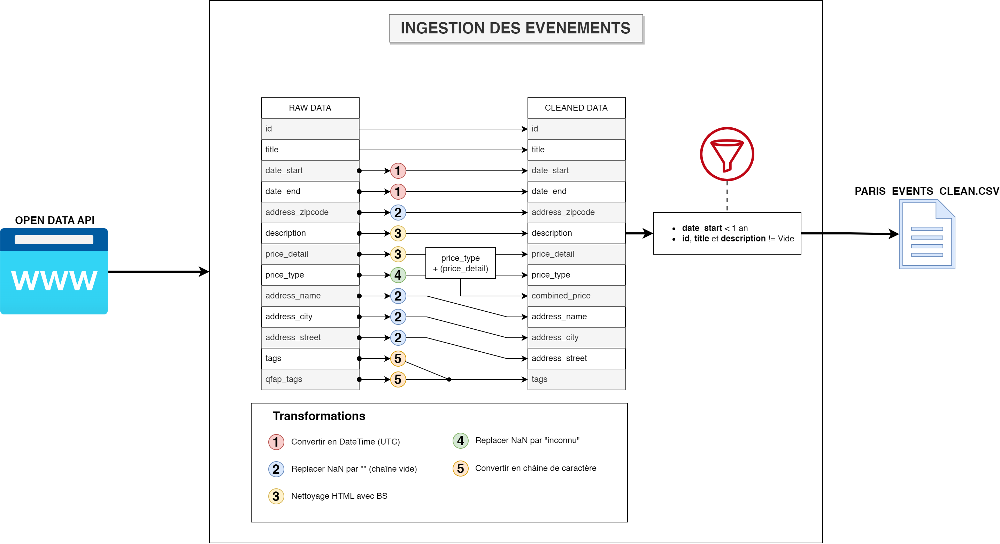
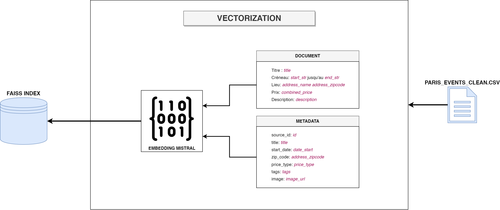
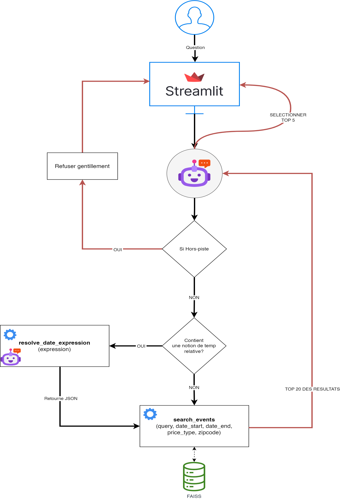

# Rapport Technique : POC Chatbot RAG - Puls-Events

**Auteur :** Abdulkadir GUVEN

**Date :** 23 Janvier 2026

**Version :** 1.0

## 1. Introduction et Objectifs

### 1.1 Contexte du Projet

L'entreprise Puls-Events, spécialisée dans la gestion d'événements culturels, cherche à innover dans l'expérience utilisateur de sa plateforme web. Actuellement, la découverte d'événements repose sur des filtres classiques (date, lieu, catégorie), ce qui peut s'avérer limitant et peu intuitif pour les utilisateurs cherchant des recommandations personnalisées.

Dans ce contexte, l'intégration d'un assistant conversationnel (chatbot) intelligent a été identifiée comme une opportunité majeure pour offrir une interaction plus naturelle et engager davantage les utilisateurs.

### 1.2 Objectifs du Proof of Concept (POC)

Ce document présente les travaux réalisés dans le cadre d'un Proof of Concept (POC) visant à évaluer la faisabilité et la pertinence d'un tel assistant. Les objectifs principaux étaient de :

1. **Démontrer la faisabilité technique** d'un système basé sur l'architecture **RAG (Retrieval-Augmented Generation)**, combinant la puissance d'une base de données vectorielle pour la recherche d'informations et d'un Grand Modèle de Langage (LLM) pour la génération de réponses.
2. **Valider la pertinence des réponses** en s'assurant que l'assistant peut comprendre des requêtes complexes en langage naturel (incluant des notions de temps, de lieu et de budget).
3. **Évaluer la stack technique imposée :** LangChain pour l'orchestration, Faiss comme base vectorielle, et les modèles de Mistral AI pour l'embedding et la génération.

### 1.3 Périmètre du POC

Pour garantir une réalisation rapide et ciblée, le périmètre de ce POC a été défini comme suit :

- **Source de données :** Le catalogue d'événements "Que Faire à Paris", via l'API OpenData de la Mairie de Paris.
- **Périmètre géographique :** Paris et l'Île-de-France.
- **Périmètre temporel :** Événements survenus au cours de la dernière année et à venir.
- **Fonctionnalités :** L'assistant est capable de répondre à des questions ponctuelles. La gestion d'une mémoire conversationnelle persistante sur le long terme n'est pas incluse dans ce POC mais est activable pour la démo.

## 2. Architecture Globale du Système

L'architecture du système repose sur une approche **Agentique**, dépassant le cadre d'un simple RAG statique. Le système n'est pas une simple chaîne linéaire, mais un agent autonome capable de raisonner, d'utiliser des outils spécifiques et de s'adapter à la demande de l'utilisateur.

### 2.1 Composants Clés

Le système s'articule autour de 5 composants majeurs :

1. **Interface Utilisateur (Streamlit) :** Une application web interactive permettant le dialogue en temps réel, la gestion de l'historique de conversation et l'affichage riche (Markdown) des réponses.
2. **Agent Orchestrateur (LangChain) :** Le "cerveau" du système. Basé sur le modèle `mistral-large-latest`, il analyse l'intention de l'utilisateur et décide de la stratégie à adopter (répondre directement, chercher une date, chercher un événement).
3. **Outils Spécialisés (Tools) :**
    - `resolve_date_expression` : Un outil intelligent utilisant un LLM dédié pour convertir des expressions temporelles naturelles ("ce week-end", "mardi prochain") en dates ISO précises, en tenant compte du contexte temporel actuel.
    - `search_events` : Le moteur de recherche hybride capable d'interroger la base vectorielle.
4. **Base de Connaissance Vectorielle (Faiss) :** Stocke les représentations sémantiques (embeddings) de ~2600 événements parisiens, générées par le modèle `mistral-embed`.
5. **Moteur de Génération (Mistral AI) :** Utilise les informations retrouvées pour formuler une réponse naturelle, enthousiaste et synthétique.

---

## 3. Pipeline de Données (ETL & Vectorisation)

La qualité des réponses du chatbot dépend directement de la qualité des données ingérées. Un pipeline robuste a été mis en place pour transformer les données brutes de l'OpenData en vecteurs exploitables.

### 3.1 Extraction et Nettoyage (ETL)

Le script `data_loader.py` orchestre la récupération et le nettoyage des données.

*Figure 1 : Pipeline d'ingestion et de nettoyage des données*

**Transformations clés effectuées :**
* **Nettoyage HTML :** Utilisation de `BeautifulSoup` pour retirer les balises `
`, ` ` des descriptions brutes et ne garder que le texte.
*   **Prix Composite :** Création d'une colonne `combined_price` fusionnant le type ("gratuit"/"payant") et le détail ("15€"), permettant au LLM de donner une information tarifaire précise.
*   **Standardisation Temporelle :** Conversion de toutes les dates en format UTC pour éviter les erreurs de comparaison lors du filtrage.
*   **Filtrage "Freshness" :** Suppression automatique des événements vieux de plus d'un an pour garder l'index pertinent.

### 3.2 Vectorisation et Indexation

Le script `vectorizer.py` transforme les données textuelles en vecteurs mathématiques via le modèle `mistral-embed`.

*Figure 2 : Stratégie de construction du Document et des Métadonnées*

**Choix architectural : Document vs Métadonnées**
*   **Le "Blob" (Document Content) :** Nous avons concaténé les informations clés (Titre, Date lisible, Lieu, Prix, Description) en une seule chaîne de texte sémantique. C'est ce que le modèle "lit" pour comprendre le sujet.
*   **Les Métadonnées :** Nous avons extrait des champs structurés (Date ISO, Zipcode, Prix type) pour permettre un filtrage déterministe strict (Post-Filtering) après la recherche sémantique.

## 4. Le Système RAG Agentique

Contrairement à une chaîne RAG linéaire classique, ce projet implémente une architecture d'**Agent Conversationnel**. Cela permet de gérer des dialogues complexes et des intentions variées.

*Figure 3 : Workflow décisionnel de l'Agent RAG*

### 4.1 Logique de Décision (Router)

L'Agent (`mistral-large-latest`) analyse chaque message utilisateur selon le flux suivant :
1.  **Hors-Sujet ?** Si la question ne concerne pas les sorties (ex: "Quelle est la capitale du Pérou ?"), l'agent refuse poliment.
2.  **Besoin de Précision Temporelle ?** Si l'utilisateur utilise des termes relatifs ("ce week-end", "mardi prochain"), l'agent active l'outil `resolve_date_expression`.
3.  **Recherche Nécessaire ?** Si tous les paramètres sont clairs, l'agent active l'outil `search_events`.
4.  **Besoin de Clarification ?** Si la demande est trop vague ("Je veux sortir à Paris"), l'agent pose des questions en retour (Slot Filling) au lieu de chercher au hasard.

### 4.2 L'outil Intelligent : `resolve_date_expression`

Les LLM ont souvent du mal avec la date actuelle. Cet outil spécifique :
* Prend en entrée une expression naturelle ("fin du mois").
* Reçoit en contexte la **date système exacte du jour**.
* Retourne une période structurée au format JSON (ex: `{"start": "2026-01-30", "end": "2026-01-31"}`).
Cela garantit que le moteur de recherche reçoit toujours des dates valides.

### 4.3 Stratégie de Recherche Hybride (`search_events`)

Pour pallier les limitations de Faiss (qui ne gère pas nativement le pré-filtrage complexe sur des chaînes de caractères), nous avons opté pour une stratégie de **"Maximal Retrieval & Post-Filtering"**.

1. **Maximal Retrieval (`k=3000`) :** Nous demandons à Faiss de récupérer une très large quantité de documents (la quasi-totalité de la base pertinente). Cela évite que des événements pertinents chronologiquement soient exclus car leur score sémantique était légèrement trop bas.
2. **Filtrage Déterministe (Python) :** Un code Python strict applique les filtres sur les métadonnées (Date >= Date demandée, Code Postal exact, Gratuité).
3. **Tri Chronologique :** Les résultats survivants sont triés par date (du plus proche au plus lointain) avant d'être présentés au LLM.

Cette approche garantit **zéro hallucination** sur les dates et les lieux, tout en profitant de la flexibilité sémantique pour le thème de l'événement.

## 5. Résultats Obtenus et Limites

### 5.1 Résultats Qualitatifs

Les tests utilisateurs (voir annexe ou démo) montrent une excellente capacité du système à gérer des cas variés :

*   **Précision Sémantique :** Une recherche sur "Musique classique" remonte bien des concerts, récitals et opéras, même si le mot "classique" n'est pas présent, grâce à la vectorisation Mistral.
*   **Précision Temporelle :** Les demandes de type "ce week-end" retournent exclusivement des événements du samedi/dimanche à venir, validant l'efficacité du tool `date_resolver` couplé au filtrage strict.
*   **Comportement Conversationnel :** L'agent est capable de refuser les demandes hors-périmètre ("Lyon") et de demander des précisions si la requête est trop vague ("Je veux sortir").

### 5.2 Limites Identifiées

Malgré la réussite du POC, certaines limitations inhérentes à l'architecture actuelle ont été identifiées :

1.  **Latence :** L'utilisation de modèles "Large" (Mistral Large) combinée à une chaîne d'outils séquentielle (Agent -> Date -> Search -> LLM) induit une latence de quelques secondes (3s à 8s) pour la réponse finale. C'est acceptable pour un POC mais devra être optimisé.
2.  **Dépendance à la qualité des données (Dirty Data) :** Le système de filtrage géographique repose sur le `address_zipcode`. Or, une partie des événements (notamment les courses à pied ou parcours itinérants) ne possède pas de code postal valide dans la source OpenData. Ces événements, bien qu'indexés, sont "invisibles" pour les filtres géographiques stricts.
3.  **Scalabilité de l'approche Post-Filtering :** La stratégie de récupérer 3000 vecteurs (`k=3000`) pour filtrer en Python fonctionne parfaitement sur un volume de 2600 événements. Cependant, si la base grandit à 1 million d'événements, cette approche deviendra inefficace en termes de mémoire et de temps de calcul.

## 6. Recommandations pour la Version Finale (V2)

Pour transformer ce POC en produit de production robuste, nous recommandons les évolutions suivantes :

### 6.1 Migration de la Base Vectorielle
Remplacer Faiss (librairie locale) par une base de données vectorielle managée (comme **Qdrant**, **Weaviate** ou **Pinecone**).
*   **Pourquoi ?** Ces bases supportent le **Pre-Filtering Natif**. Cela permettrait de filtrer par date *avant* la recherche vectorielle, résolvant ainsi le problème de scalabilité et rendant inutile le hack du `k=3000`.

### 6.2 Optimisation de la Latence (Caching)
Implémenter un système de cache sémantique (Semantic Cache) : si une question similaire ("concert ce soir") a été posée il y a 10 minutes, le système renvoie la réponse stockée sans ré-interroger le LLM ni la base vectorielle.

---

**Conclusion :**

Ce POC valide l'intérêt et la faisabilité technique d'un assistant conversationnel pour Puls-Events. L'approche agentique offre une flexibilité supérieure aux moteurs de recherche classiques, et les résultats sont pertinents grâce à la qualité des modèles Mistral AI. L'architecture est prête à être industrialisée moyennant l'adoption d'une base vectorielle plus robuste.
